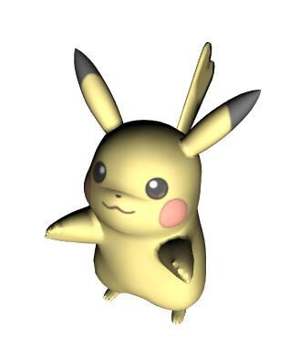

English| [简体中文](./README.CN.md)
# react-3d-viewer [](https://www.npmjs.com/package/react-3d-viewer) 
A 3D model viewer component based on react.js. Demo located at https://dwqdaiwenqi.github.io/react-3d-viewer/site/



## Features
* Component-Based
* Update UI using `.setState()` method
* Support gltf,obj,mtl,json,dae model formats - other formats will be added in the future.
* Provied `<DirectionLight/>` and `<AmbientLight/>` light components - other components will be provided in the future.
---
## Usage
Get react-3d-viewer through npm or cdn:
```js
npm i react-3d-viewer
```
* [https://unpkg.com/react-3d-viewer@latest/dist/scripts/react-3d-viewer.js](https://unpkg.com/react-3d-viewer@latest/dist/scripts/react-3d-viewer.js)

### Work with module bundler
```js
import {OBJModel} from 'react-3d-viewer'

render(){
  return(
    <div>
      <OBJModel src="./a.obj" texPath=""/>
    </div>
  )
}
```

```js
import {Tick,MTLModel} from 'react-3d-viewer'

render(){
  return(
    <div>
     <MTLModel 
        enableZoom = {false}
        position={{x:0,y:-100,z:0}}
        rotation={this.state.rotation}
        texPath="./src/lib/model/"
        mtl="./src/lib/model/freedom.mtl"
        src="./src/lib/model/freedom.obj"
     />
    </div>
  )
}
componentWillMount(){
    this.tick.animate = false
}
componentDidMount(){
  this.tick = Tick(()=>{
    var {rotation} = this.state
    rotation.y += 0.005
    this.setState({rotation})

  })
}
```

```js
import {DAEModel,DirectionLight } from 'react-3d-viewer'

render(){
  return(
    <div>
     <DAEModel 
        src={'./src/lib/model/Ruins_dae.dae'}
        onLoad={()=>{
          // ...
        }}
      >
        <DirectionLight color={0xff00ff}/>
      </DAEModel>
    </div>
  )
}
 
```
### HTML
```html
<script src="https://unpkg.com/react-3d-viewer@latest/dist/scripts/react-3d-viewer.js"></script>
<script src="https://unpkg.com/react@16.4.1/umd/react.production.min.js"></script>
<script src="https://unpkg.com/react-dom@16.4.1/umd/react-dom.production.min.js"></script>
<div id="example"></div>
<script >
  // It's not recommended to use this way.
  ReactDOM.render(
    React.createElement('div',{ style: { width: 600, margin: '0px auto' } },
    React.createElement(React3DViewer.JSONModel, {
      src:'./src/lib/model/kapool.js'
    })
  )
  ,document.getElementById('example'));
</script>
```
To view a demo,click [here](https://dwqdaiwenqi.github.io/react-3d-viewer/site/). 

## Properties
Property        |       Type            |       Default         |       Description
:-----------------------|:--------------|:--------------|:--------------------------------
width | number  | 500  | The width of container
height | number  | 500  | The height of container
texPath | string | '' | Set the base path for the img file
onLoad | function | undefined | A function to be called after the loading is successfully completed
onProgress | function | undefined |  A function to be called while the loading is in progress
enableKeys | boolen | true | Enable or disable the use of keyboard controls
enableRotate | boolen | true | Enable or disable horizontal and vertical rotation of the camera
enableZoom | boolen | true | Enable or disable zooming of the camera
enabled | boolen | true | Whether or not the controls are enabled
src | string | undefined | The path of the file
mtl | string | undefined | The path of the .mtl file
anitialias | boolen | true | Whether to perform antialiasing
position | object | {x:0,y:0,z:0} | Object's position
rotation | object | {x:0,y:0,z:0} | Object's rotation

## How it works
The `<FormatModel>` creates a camera, scene, light source and a WebGL renderer.The DOM returned by the renderer (a `<canvas>` element) is added to the document and configured to fill the viewport.
Scene is rendered in real time. In the `componentDidUpdate` method, the changes of `props` are detected and the attributes of objects are changed.

## License

MIT


